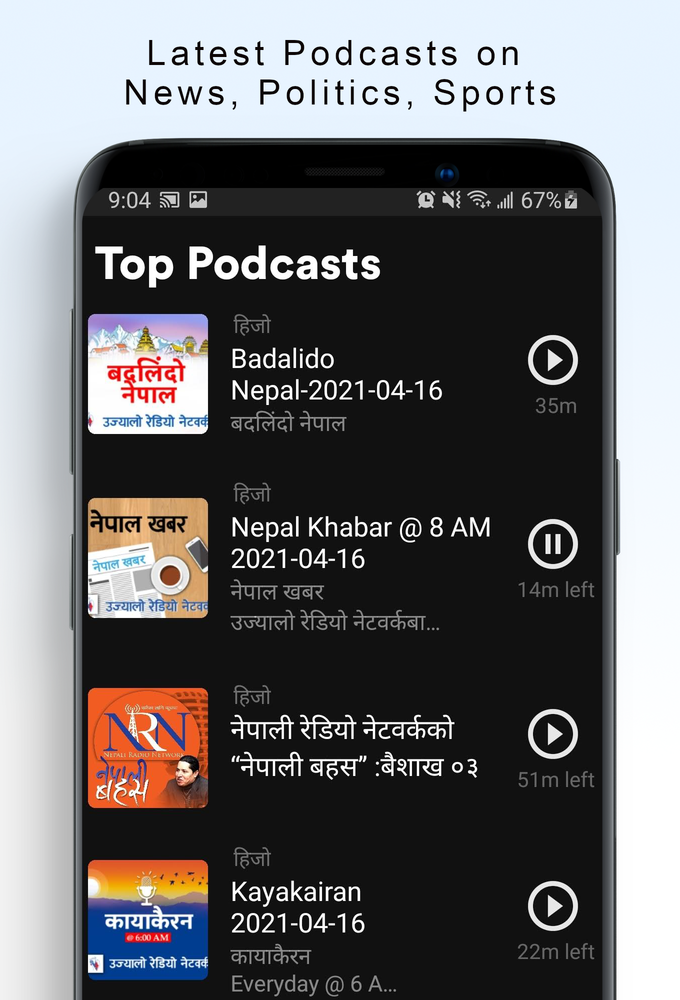
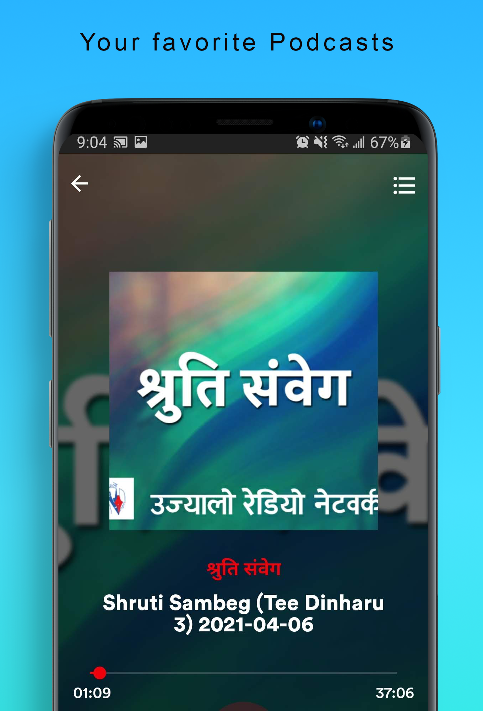
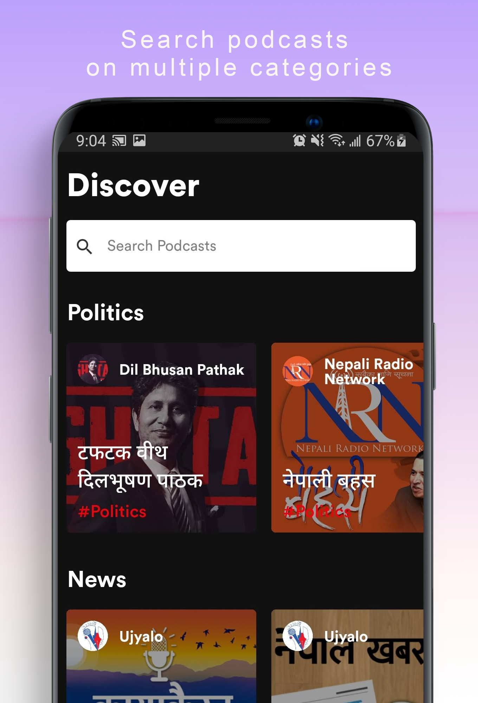

# NepalToday Podcast

<br/>
<div>

<a href='https://play.google.com/store/apps/details?id=com.siristechnology.nepaltodaypodcast&pcampaignid=pcampaignidMKT-Other-global-all-co-prtnr-py-PartBadge-Mar2515-1' target='_blank' rel="noopener noreferrer"></a>
</div>

## Latest screenshot

<div>



</div>

## Functionalities

- Choose your interests (all, technology, philosophy, science, business, pop-culture or history - it will be used to make requests in order to have a personalized app with what the user want to hear about)

- Get informations about a specific Author, with his New Releases/Featured Podcasts and Related Authors

- Get Informations about a specific Podcast, with its description and Author

- Listen and download a single podcasts to listen offline (no need to create a playlist)

- Playlists
	- Create, Edit and Remove your Playlists
	- Download Playlists to listen when the user goes offline
	- Undownload Playlists

- Player to listen the selected podcasts and also be able to: 
	- Download the current podcast
	- Access the queue of next podcasts that will be played
	- Remove podcasts from the queue
	- Play/Pause the current Podcast
	- Next/Previous podcast on the Playlist

- Bottom Player
	- Access the bottom player out of the Player screen in order to keep tracking the current podcast
	- Get the Author and the Title of the current podcast
	- Play/Pause/Forward the current podcast
	- Track the timer of the current podcast

- Discover
	- A Dashboard with:
	  - Trending Authors
	  - Hottest Podcasts
	  - New Podcasts Released

- Search

	- Search for Authors by name

	- Get information about a certain category, showing it's featured and trending podcats, and the authors that talk about this category

- Library
	- Create Playlists, add podcasts and download it to listen offline

	- Access Your Podcasts (Downloaded + Podcasts saved on your Playlists) in the form of playlist

	- Access your Podcasts downloaded in the form of playlist
	
	- Access recently played podcasts in the form of playlist

	- Change your interests

- Settings

	- Choose between the Dark and Light theme

## Getting Started

### Prerequisites

To run this project in the development mode, you'll need to have a basic environment to run a React-Native App, that can be found [here](https://facebook.github.io/react-native/docs/getting-started).

Also, you'll need to the server running locally on your machine. You can find the server and all the instructions to start the server [here](https://github.com/siristechnology/nepaltoday-podcast-api).

### Installing

**Cloning the Repository**

```
$ git clone git@github.com:siristechnology/nepaltoday-podcast-app.git

$ cd nepaltoday-podcast-app
```

**Installing dependencies**

```
$ yarn
```

### Connecting the App with the Server

1 - Follow the instructions on the [nepaltoday-podcast-server](https://github.com/siristechnology/nepaltoday-podcast-api) to have the server up and running on your machine.

2 - With the server up and running, go to the [/.env.development](https://github.com/siristechnology/nepaltoday-podcast-api/blob/master/.env.development) file and edit the SERVER_URL value for the IP of your machine (you can have some issues with _localhost_ if you're running on an android physical device, but you can use localhost safely on iOS).

It should looks like this:

SERVER_URL=http://**_IP_OF_YOUR_MACHINE_**:3001/nepaltoday-podcast/api/v1

*or*

SERVER_URL=http://localhost:3001/nepaltoday-podcast/api/v1

### Running

With all dependencies installed and the environment properly configured, you can now run the app:

Android

```
$ yarn android
```

iOS

```
$ yarn ios
```

## Built With

- [React-Native](https://facebook.github.io/react-native/) - Build the native app using JavaScript and React
- [React-Navigation](https://reactnavigation.org/docs/en/getting-started.html) - Router
- [Redux](https://redux.js.org/) - React State Manager
- [Redux-Saga](https://redux-saga.js.org/) - Side-Effect middleware for Redux
- [Axios](https://github.com/axios/axios) - HTTP Client
- [ESlint](https://eslint.org/) - Linter
- [React-Native-Dotenv](https://github.com/zetachang/react-native-dotenv) - Configs from .env file
- [Flow](https://redux-saga.js.org/) - Static Type Checker
- [Prettier](https://prettier.io/) - Code Formatter
- [Babel](https://babeljs.io/) - JavaScript Compiler
- [Reactotron](https://infinite.red/reactotron) - Inspector
- [Styled-Components](https://www.styled-components.com/) - Styles
- [React-Native-Fast-Image](https://github.com/DylanVann/react-native-fast-image) - Image Loader
- [React-Native-Linear-Gradient](https://github.com/react-native-community/react-native-linear-gradient) - Gradient Styles
- [React-Native-SplashScreen](https://github.com/crazycodeboy/react-native-splash-screen) - Splashscreen of the App
- [React-Native-Vector-Icons](https://github.com/oblador/react-native-vector-icons) - Icons
- [React-Native-Side-Menu](https://github.com/react-native-community/react-native-side-menu) - Side Menu used on Player screen
- [React-Native-Swipeout](https://github.com/dancormier/react-native-swipeout) - Swipe for edit/remove playlists and remove podcasts inside some playlist
- [React-Native-Video](https://github.com/react-native-community/react-native-video) - Consume the audio files via streaming
- [React-Native-FS](https://github.com/itinance/react-native-fs) - Handle download/undownload podcasts on file-system


## Support tools

- [Image-Resize](https://imageresize.org) - Resize the Images
- [Amazon S3](https://aws.amazon.com/pt/s3/) - Storage Service

## License

This project is licensed under the MIT License - see the [LICENSE.md](https://github.com/siristechnology/nepaltoday-podcast-api/blob/master/LICENSE) file for details
